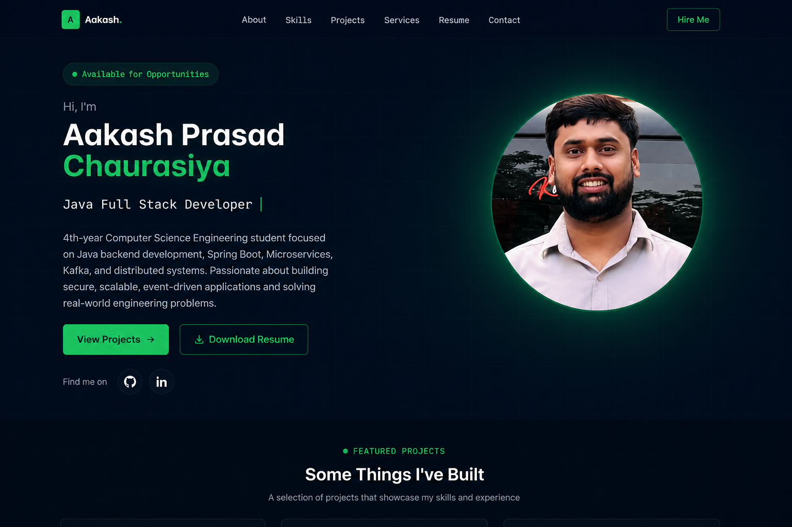
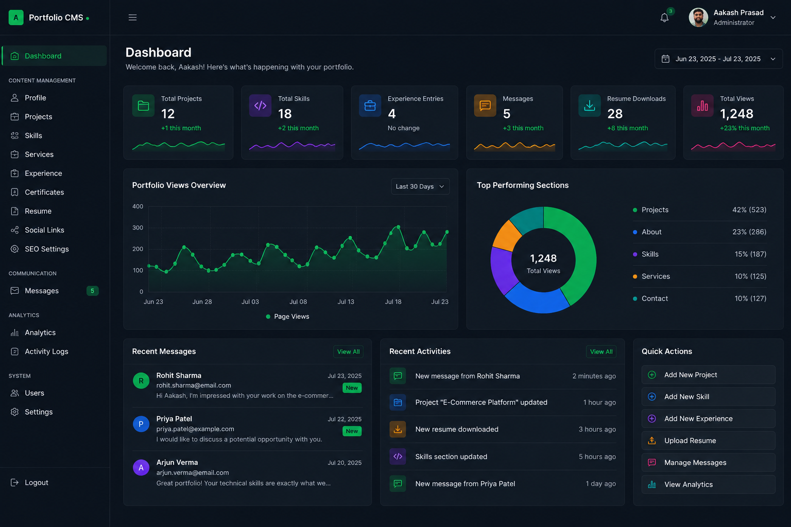
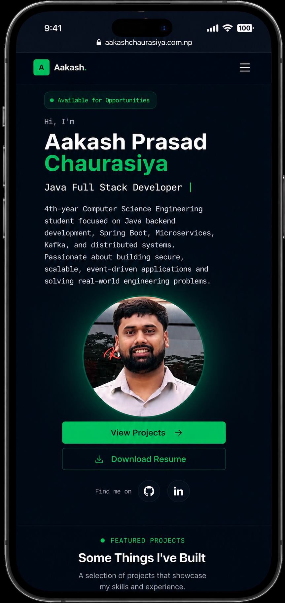

# Aakash Chaurasiya — Portfolio CMS

A full-stack, CMS-driven developer portfolio built to manage and showcase projects, technical skills, professional experience, services, certificates, resume, social profiles, and contact messages through a dedicated admin dashboard.

The application separates portfolio content from the frontend, allowing updates to be managed through the CMS without modifying or redeploying frontend code for routine content changes.

## Live Portfolio

**Website:** https://www.aakashchaurasiya.com.np

---

## Overview

This project is more than a static developer portfolio. It is a full-stack Portfolio Content Management System designed around two main applications:

- A responsive public portfolio for visitors
- A secure admin dashboard for managing portfolio content

The public website retrieves content dynamically from the backend API, while the admin panel provides centralized control over projects, skills, services, experience, certificates, resume, social links, SEO configuration, contact messages, and analytics.

The system was designed with maintainability, security, responsive design, and production deployment in mind.

---

## Screenshots

### Portfolio



### Admin Dashboard



### Mobile Experience



> Screenshots can be replaced whenever the portfolio UI is updated.

---

## Key Features

### Public Portfolio

- Responsive desktop, tablet, and mobile interface
- Dynamic profile and professional information
- Project showcase
- Technical skills
- Services
- Professional experience
- Certificates
- Downloadable resume
- Social media integration
- Contact form
- Smooth section navigation
- Mobile navigation
- SEO metadata management
- Open Graph metadata support
- Portfolio interaction analytics

### Admin CMS

A dedicated administration dashboard provides centralized management of portfolio content.

Administrators can manage:

- Profile information
- Projects
- Skills
- Services
- Experience
- Certificates
- Resume
- Social links
- SEO settings
- Contact messages
- Portfolio analytics

Content updates made through the dashboard are stored in the database and reflected dynamically on the public portfolio.

---

## Authentication & Security

The administration system is protected using a secure authentication flow.

Implemented features include:

- JWT-based authentication
- OTP verification
- Protected admin routes
- Spring Security
- Password protection
- Request validation
- API security configuration
- Rate limiting
- Secure environment-based configuration

OTP emails are delivered through the Brevo HTTP API.

---

## Contact & Notification System

Visitors can contact me directly through the portfolio.

When a message is submitted:

1. The frontend validates the form.
2. The message is sent to the Spring Boot API.
3. The message is stored in the database.
4. It becomes available in the admin dashboard.
5. The administrator receives an email notification.
6. Message status can be managed through the CMS.

This provides a complete communication workflow instead of relying on a third-party contact form.

---

## Analytics

The portfolio includes custom interaction tracking for selected user actions.

Examples include:

- Project views
- GitHub clicks
- LinkedIn clicks
- Resume downloads

Analytics are collected by the backend and displayed through the admin dashboard.

---

## Tech Stack

### Frontend

- React
- Vite
- Tailwind CSS
- Framer Motion
- React Icons
- Axios

### Backend

- Java 21
- Spring Boot
- Spring Security
- Spring Data JPA
- Hibernate
- JWT
- Maven

### Database & Services

- MySQL
- Cloudinary
- Brevo Email API

### Deployment

- Vercel — Frontend
- Render — Backend
- Cloudflare — DNS and domain configuration
- GitHub — Source control and deployment workflow

---

## Architecture

```text
                         ┌──────────────────────┐
                         │       Visitor        │
                         └──────────┬───────────┘
                                    │
                                    ▼
                         ┌──────────────────────┐
                         │   React Portfolio    │
                         │  Vite + Tailwind CSS │
                         └──────────┬───────────┘
                                    │
                               REST API
                                    │
                                    ▼
                         ┌──────────────────────┐
                         │  Spring Boot Backend │
                         │ Security · JWT · JPA │
                         └───────┬──────┬───────┘
                                 │      │
                    ┌────────────┘      └─────────────┐
                    ▼                                 ▼
             ┌─────────────┐                   ┌─────────────┐
             │    MySQL    │                   │ Cloudinary  │
             │  Database   │                   │    Media    │
             └─────────────┘                   └─────────────┘
                    │
                    │
                    ▼
             ┌─────────────┐
             │ Brevo Email │
             │     API     │
             └─────────────┘
```

---

## Project Structure

```text
portfolio/
│
├── backend/
│   ├── src/main/java/com/aakash/portfolio/cms/
│   │   ├── cloudinary/
│   │   ├── config/
│   │   ├── controller/
│   │   ├── dto/
│   │   ├── entity/
│   │   ├── repository/
│   │   ├── security/
│   │   ├── service/
│   │   └── PortfolioCmsApplication.java
│   │
│   ├── src/main/resources/
│   └── pom.xml
│
├── src/
│   ├── components/
│   ├── pages/
│   ├── sections/
│   ├── services/
│   └── ...
│
├── public/
├── docs/
│   └── screenshots/
├── package.json
└── README.md
```

---

## Local Development

### Prerequisites

Make sure the following are installed:

- Java 21
- Maven
- Node.js
- npm
- MySQL
- Git

### Clone the Repository

```bash
git clone https://github.com/B-TechCode/aakashchaurasiya-portfolio.git
cd aakashchaurasiya-portfolio
```

### Frontend

Install dependencies:

```bash
npm install
```

Start the development server:

```bash
npm run dev
```

### Backend

Move into the backend directory:

```bash
cd backend
```

Build the application:

```bash
mvn clean package
```

Run Spring Boot:

```bash
mvn spring-boot:run
```

---

## Environment Configuration

The application relies on environment variables for production configuration, including database credentials, authentication secrets, Cloudinary configuration, email service credentials, and frontend/backend URLs.

Example:

```env
DB_URL=your_database_url
DB_USERNAME=your_database_username
DB_PASSWORD=your_database_password

JWT_SECRET=your_jwt_secret

CLOUDINARY_CLOUD_NAME=your_cloud_name
CLOUDINARY_API_KEY=your_api_key
CLOUDINARY_API_SECRET=your_api_secret

BREVO_API_KEY=your_brevo_api_key
```

Never commit production credentials, API keys, database passwords, or JWT secrets to the repository.

---

## Production Deployment

The application uses separate frontend and backend deployments.

```text
GitHub
   │
   ├──── push to main ────► Vercel ────► React Frontend
   │
   └──── push to main ────► Render ─────► Spring Boot API
                                      │
                                      ▼
                                    MySQL
```

The production portfolio is served through the custom domain:

**https://www.aakashchaurasiya.com.np**

---

## Design Goals

The project was built around several engineering goals:

**CMS-driven content** — portfolio information can be managed without hardcoding content into frontend components.

**Separation of concerns** — frontend presentation, backend business logic, persistence, authentication, and external services remain clearly separated.

**Responsive experience** — the interface is designed to work across desktop and mobile devices.

**Secure administration** — administrative functionality is separated from the public portfolio and protected through authentication and authorization.

**Production readiness** — environment-based configuration, cloud media storage, external email delivery, database persistence, and automated deployment are incorporated into the architecture.

---

## Future Improvements

Potential enhancements include:

- Extended analytics and reporting
- Contact-message search and filtering
- Additional admin activity monitoring
- Automated testing
- Performance monitoring
- Improved accessibility auditing
- Additional SEO and structured-data support

---

## Author

**Aakash Prasad Chaurasiya**

Java Full Stack Developer focused on building secure, scalable, and modern web applications using Java, Spring Boot, React, microservices, and related technologies.

**Portfolio:** https://www.aakashchaurasiya.com.np

---

## License

This project is maintained as a personal portfolio and CMS project.

The source code is publicly available for educational and portfolio demonstration purposes. Unless a separate license is provided, no permission is granted to redistribute, reproduce, or commercially use the project as your own.
